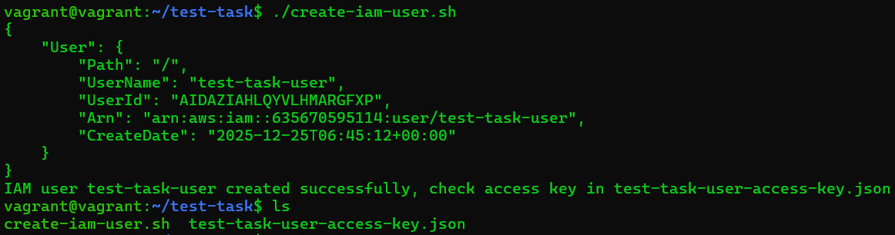
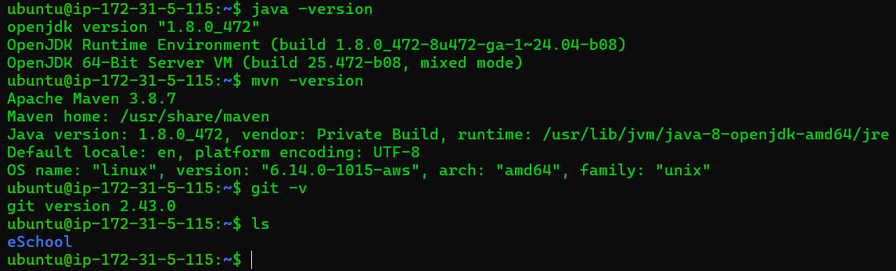
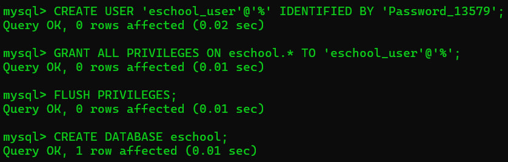
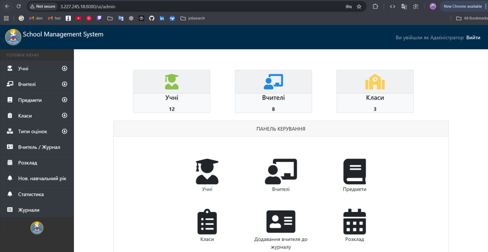
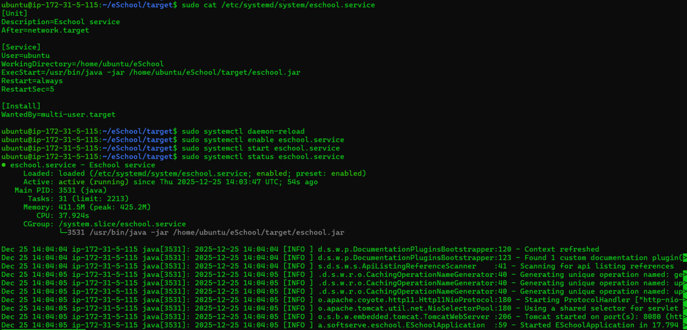

# SoftServe-technical-test
## Description
This test technical task involves deploying infrastructure components and a Java Web
application with a connection to a MySQL database on AWS. The Java web-app requires
some reconfiguration inside its configuration files (no code changes required). The web
application must have access to the Internet and be able to connect to the MySQL
database server. While doing this task you will face and troubleshoot permissions
issues, connectivity/networking issues, relative paths issues (where and which
command to run), and so on. Each completed or partly completed step will be
accepted.
### Step 1. Create AWS Free Tier Account
To start the technical test task, you will need to create a free account on AWS. Under the
AWS Free Tier, you can access specific services for free within set limits for 12 months,
which is sufficient to complete this task; if you already have an account, you may use it
instead.
Acceptance criteria: Login to AWS Management Console, connect to AWS CLI.
### Step 2. Create an IAM User
For further deployments, please create an IAM user with access using the AWS CLI.
Write a script to login to the AWS CLI, create an IAM user, and assign the
AdministratorAccess (or similar) policy.
Save the Access Key ID and Secret Access Key.
While the AWS Management Console can be used, the AWS CLI is preferred.
Acceptance criteria: IAM user creation script, saved Access Key ID, and Secret Access
Key.
### Step 3. Deploy Two EC2 Instances on AWS
Please prepare your local environment to run Terraform code.
Configure providers.tf with values from the previous step.
Write Terraform code to deploy the first EC2 instance with the following requirements:
- OS: Ubuntu 22.04 or higher
- Size: t3.micro (Free Tier eligible)
- Public access ports 22
Add code to deploy a second EC2 instance with the following requirements:
- OS: Ubuntu 22.04 or higher
- Size: t3.micro (Free Tier eligible)
- Public access ports 22
The AWS Management Console could be used, but Terraform is preferred.
Acceptance criteria: Configured environment to run Terraform code, EC2 deployment
Terraform code, connect to EC2 via SSH.
### Step 4. Prepare First EC2 Instance
Please connect to the first EC2 instance via SSH.
Install openjdk-8 on your server.
Install maven on your server.
Install Git on your server
Clone repository https://github.com/yurkovskiy/eSchool into your folder.
Acceptance criteria: All software is installed and the repository is cloned.
### Step 5. Prepare Second EC2 Instance
Please connect to the second EC2 instance via SSH.
Read readme for eSchool application.
Install MySQL on your server.
Configure MySQL server user with strong password.
Create an empty MySQL database inside of MySQL server and name it eschool.
Modify Security Group rules to let MySQL accept connections from the first EC2
instance.
Acceptance criteria: MySQL server installed, user created, and database created.
### Step 6. Deploy eSchool Web Application
Please connect to the first EC2 instance via SSH.
Go to eSchool folder.
Find file ScheduleControllerIntegrationTest.java and comment its content.
Find file application.properties and edit it in the next way:
- spring.datasource.url should use link or IP address of your MySQL server instead
of localhost inside of connection string. Other parts of connection string should
remain as original
- spring.datasource.username should use login of your MySQL server user
- spring.datasource.password should use password of your MySQL server user
By using maven – clean up the project.
By using maven – build the project. It will take some time as build process includes
some tests. Pay attention to the errors that you could get. Important notice: this process
is very consumable so your web server could face some performance issues. Tip: if it
takes too much time or stuck in some moment without reason – try to increase size of
your web server (e.g., to t3.small) and redeploy it via Terraform.
If everything finished successfully, as the result of build should be created new folder
target. Go inside that folder and find eschool.jar. This is your web application. By using
Java run your application and check if you can reach its web interface through browser.
Pay attention to the port (tip: this web application based on Tomcat web server).
Modify EC2 Security Group rules to let Tomcat accept connections from the internet.
Check the login on web app by using login admin and password admin.
Add application into startup and automatically runs after server restart.
Acceptance criteria: eSchool application is accessible from the Internet, web
application starts automatically after server restart.

## Report
1. I used my old aws free tier account.
2. Made script for IAM user creation. (check script at /create-iam-user.sh)

3. Deployed 2 EC2 instances via terraform. (check code at /terraform/)
4. Prepared first EC2 instance.

5. Prepared second EC2 instance.

6. Deployed eSchool Web Application. Had to change instance type to t3.small. (check service at /eschool.service)

